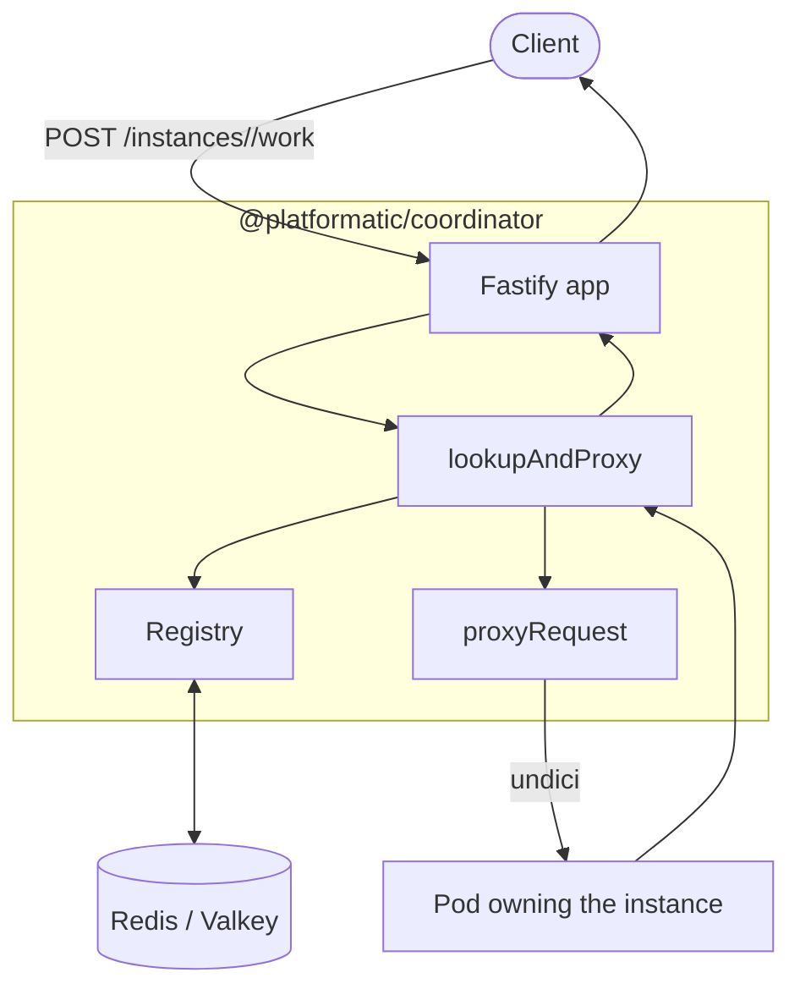
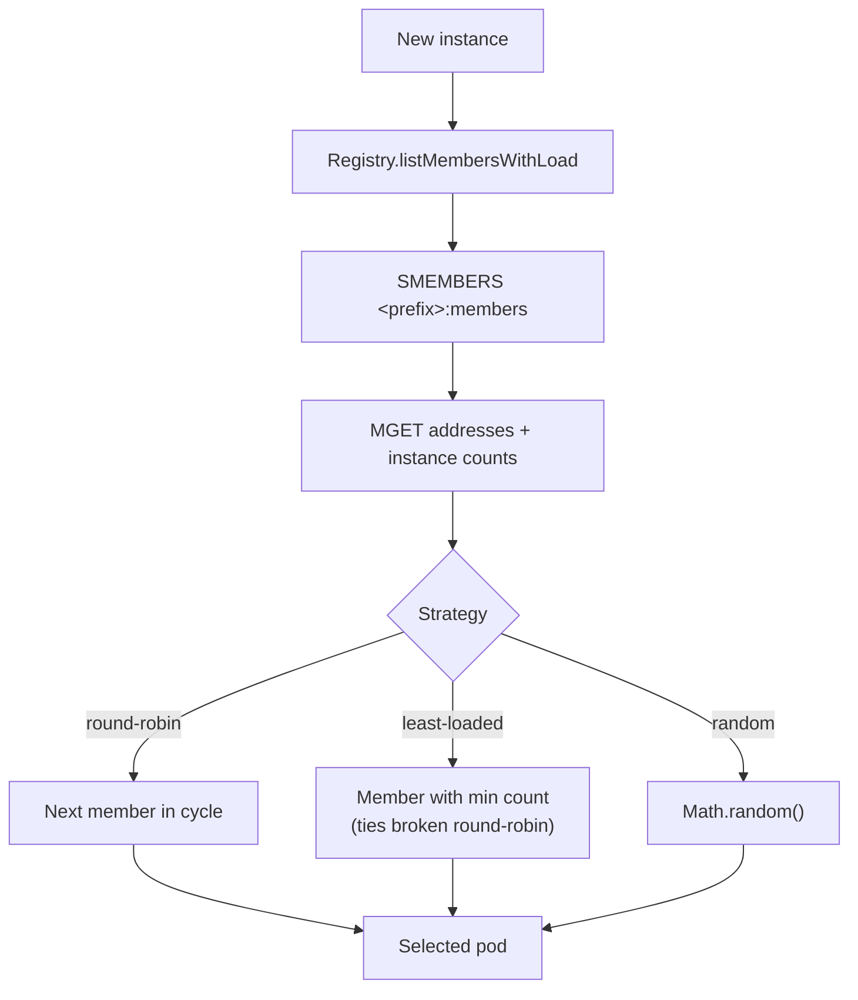
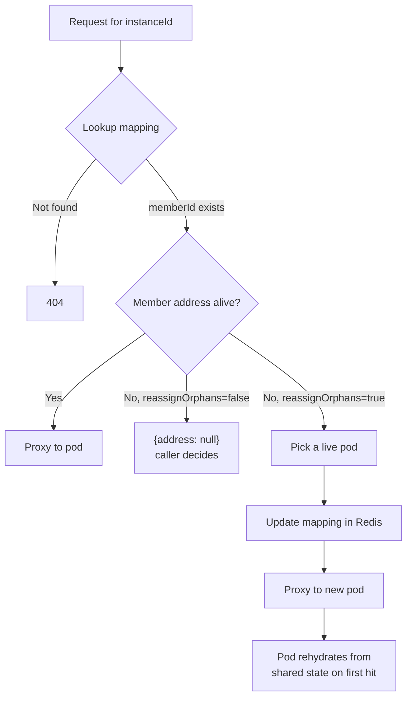

# @platformatic/coordinator

Sticky-instance coordinator library for multi-pod Fastify services. Routes a client's request -- carrying an instance id -- to the pod that owns that instance, using Redis as the source of truth. Provides a member registry, allocation strategies, three Fastify helpers for the common sticky-routing patterns, and small utilities for the parts that are easy to get wrong.

This package is a library, not a Watt stackable. It is consumed by **preset stackables** (e.g. `@platformatic/regina-coordinator`) that publish their own API contract on top.

## What it solves

You have N pods, each holding stateful instances (chat sessions, connection pools, simulations, sandboxes). A client request carries an instance id. You need that request to land on the pod that owns that instance. When pods die, surviving pods should be able to take over (assuming they can rehydrate from shared state). Allocation of new instances should spread across pods.

## Concepts

- **Member** -- a pod, identified by `memberId`, advertising its address. The pod registers itself in Redis on startup and keeps its address key alive with a TTL it refreshes from a heartbeat loop.
- **Instance** -- an opaque id whose ownership is bound to a member. The coordinator writes this binding when an instance is created and reads it on every subsequent request.
- **Sticky mapping** -- `instance -> member`, **no TTL**. Outlives the member's address key, which is what makes orphan detection possible.
- **Allocation strategy** -- how a fresh instance is assigned to a member: round-robin, least-loaded, or random.

## How a request is routed



Per request: two Redis reads (instance mapping, then member address) plus one upstream HTTP call. Stateless across coordinator replicas because Redis is the source of truth.

## Install

```sh
npm install @platformatic/coordinator
```

Peer dependency: `fastify >= 5`. Runtime dependencies: `iovalkey`, `undici`.

## Redis layout

With `keyPrefix: 'myservice'`:

| Key                                       | Type   | Owner       | Notes                                   |
|-------------------------------------------|--------|-------------|-----------------------------------------|
| `myservice:members`                       | set    | pod         | the pod's `memberId` lives here         |
| `myservice:member:<memberId>`             | string | pod         | pod's address; TTL refreshed by heartbeat |
| `myservice:member:<memberId>:instances`   | string | pod         | pod's instance count (for `least-loaded`) |
| `myservice:instance:<instanceId>`         | string | coordinator | binds instance to memberId, **no TTL**  |

The coordinator only writes the `:instance:` keys. Everything under `:members` and `:member:*` is owned by the pods themselves.

## Pod responsibilities

A pod that wants to participate in a coordinator-managed mesh must:

1. **Register on startup**:
   ```
   SADD <prefix>:members <memberId>
   SET  <prefix>:member:<memberId> <address> EX 30
   ```
2. **Heartbeat every ~10s** to refresh the TTL on `<prefix>:member:<memberId>`. Skipping this is what marks the pod dead.
3. **(Optional) Track load** for the `least-loaded` strategy:
   ```
   INCR <prefix>:member:<memberId>:instances   # on instance create
   DECR <prefix>:member:<memberId>:instances   # on instance close
   ```
4. **Deregister on graceful shutdown**:
   ```
   SREM <prefix>:members <memberId>
   DEL  <prefix>:member:<memberId>
   ```

The library does not provide pod-side helpers -- pods are typically a different process with its own framework. The contract is just the four operations above.

## Allocation strategies



Pick one based on workload shape:

- **`round-robin`** (default) -- even distribution, ignores load. Cheapest. Right when instances are roughly uniform in cost.
- **`least-loaded`** -- reads each pod's instance count from Redis (one `MGET` round-trip), picks the minimum, breaks ties round-robin. Right when instances are heavy and you want to spread them (e.g. connection pools, long-lived simulations).
- **`random`** -- one `Math.random()`. Right for sharded scenarios where you want zero coordination state.

You can also pass a custom `AllocationStrategy` instance to the `Registry` constructor.

## Orphan detection

When a pod's address key TTL expires (pod crashed, pod missed heartbeats), its instance mappings still point at the dead `memberId`. The next request for one of those instances surfaces the situation:



`reassignOrphans` is opt-in **per call** (per route, in practice). Use `true` only when your pods can rebuild an instance's state from shared storage on demand. Use `false` (the default) when "pod is dead" should mean "instance is gone" -- the helper returns a `{ address: null }` result and the route handler decides what to do.

## Sticky helpers

Three Fastify route handlers cover the patterns that repeat across consumers. Each is a one-liner at the call site, captures one specific footgun, and bumps metrics consistently.

### `lookupAndProxy`

```ts
app.post('/instances/:id/work', lookupAndProxy(registry, {
  instanceFrom: req => req.params.id,
  reassignOrphans: true
}))
```

Resolves the instance, proxies the request to the owning pod, drains the response. On unknown instance: 404. On dead pod with `reassignOrphans: false`: also 404. On dead pod with `reassignOrphans: true`: picks a new pod, rewrites the mapping, proxies there.

Defaults: `reassignOrphans: false`, `notFoundMessage: 'Instance not found'`.

Doesn't handle: streaming, response-header rewrites, custom error envelopes. For those, drop down to `proxyRequest` + `drainAndReply` and write the route inline.

### `pickAndRegister`

```ts
app.post('/instances', pickAndRegister(registry, {
  registerIdFrom: res => res.instanceId
}))
```

Picks a member via the strategy, proxies the create request to it, and registers the resulting id in Redis **only** if the upstream returns `expectedStatus`. The footgun this kills: forgetting to gate `registerInstance` on success, which would otherwise bind Redis mappings to instances the pod never created.

On no live pods: 503 with the configured message. The upstream's response body is forwarded to the client verbatim.

Defaults: `expectedStatus: 201`, `unavailableMessage: 'No pods available'`.

### `lookupAndDeregister`

```ts
app.delete('/instances/:id', lookupAndDeregister(registry, {
  instanceFrom: req => req.params.id
}))
```

Resolves the instance (no orphan reassignment -- a dead instance cannot be deleted). If the pod is alive, proxies the DELETE; on `expectedStatus`, drains and deregisters. If the pod is dead, **skips the proxy entirely** and just removes the Redis mapping. The footgun this kills: forcing a freshly assigned pod to spin an instance up just to delete it.

Defaults: `expectedStatus: 204`, `notFoundMessage: 'Instance not found'`.

### When the helper isn't enough

Helpers cover the simple case. For streaming, header overrides, response-body massaging, or alternative error shapes, use the building blocks directly:

```ts
app.post('/instances/:id/stream', async (req, reply) => {
  const resolved = await registry.resolveInstance(req.params.id, { reassignOrphans: true })
  if (!resolved?.address) return reply.code(404).send({ error: 'Not found' })
  const u = await proxyRequest(resolved.address, req, { timeout: registry.requestTimeout })
  reply.code(u.statusCode)
  if (u.statusCode >= 400) return u.body.json()
  reply.header('content-type', 'application/x-ndjson')
  return reply.send(u.body)  // pipes the upstream readable through Fastify
})
```

## Utilities

### `proxyRequest(address, req, opts?)`

Wraps undici with the bits that are easy to forget:

- Pulls `req.method` and `req.url` from Fastify (or uses `opts.upstreamPath`).
- If `req.body` is set, JSON-stringifies it and sets `content-type: application/json`. JSON-only in v1; non-JSON requires `fastify-raw-body` and is out of scope.
- Applies `opts.timeout` as both `headersTimeout` and `bodyTimeout` on the undici call.
- Inbound headers are not propagated.

### `drainAndReply(reply, upstream)`

- Sets `reply.code(upstream.statusCode)`.
- On 204, drains the upstream body (`body.dump()`) and replies empty -- skipping this leaks sockets.
- Otherwise returns `body.json()`.

## Metrics

Signature: `createCoordinatorMetrics(prometheus?, opts?)`. The first argument is a Prometheus client; pass nothing to auto-detect from `globalThis.platformatic.prometheus` (the source Watt populates).

```ts
import { createCoordinatorMetrics, Registry } from '@platformatic/coordinator'

// Auto-detect (typical inside a Watt stackable):
const metrics = createCoordinatorMetrics(undefined, { namespace: 'myservice_coordinator' })

// Or pass an explicit client:
// const metrics = createCoordinatorMetrics({ client: promClient, registry: promRegistry }, { namespace: 'myservice_coordinator' })

const registry = new Registry({ redis, keyPrefix: 'myservice', metrics: metrics ?? undefined })
```

Two Prometheus instruments, configurable namespace:

| Metric                                | Type    | Labels             |
|---------------------------------------|---------|--------------------|
| `<namespace>_requests_total`          | counter | `route`, `result`  |
| `<namespace>_pod_count`               | gauge   | -                  |

The `route` label is the Fastify pattern (`/instances/:id/work`), so dashboards keep per-route granularity without per-call configuration. The `result` label is one of:

- `hit` -- proxied to the live owning pod
- `orphan_reassigned` -- pod was dead, reassigned
- `not_found` -- unknown instance
- `spawned` -- `pickAndRegister` succeeded with `expectedStatus`
- `unavailable` -- `pickAndRegister` had no live pods
- `deregistered` -- `lookupAndDeregister` succeeded with the live pod
- `deregistered_dead_pod` -- `lookupAndDeregister` skipped the dead pod
- `upstream_error` -- non-expected status from the upstream

`createCoordinatorMetrics` returns `null` if no Prometheus client is reachable (`globalThis.platformatic.prometheus` is the default source); helpers no-op their metric calls when the Registry has no metrics object.

The pod-count gauge is **not** auto-refreshed. Each preset is responsible for periodically calling `registry.listMembers()` and writing `metrics.podCount.set(members.length)` -- typically a 15s `setInterval` in the Fastify plugin.

## Writing a preset

A preset is the smallest possible Watt stackable that exposes its API contract using this library. Skeleton:

```ts
import fp from 'fastify-plugin'
import {
  Registry, proxyRequest, drainAndReply,
  lookupAndProxy, pickAndRegister, lookupAndDeregister,
  createCoordinatorMetrics
} from '@platformatic/coordinator'

async function myCoordinatorPlugin (app) {
  // Watt augments the Fastify instance with `.platformatic`; cast in TS.
  const config = (app as any).platformatic.config.myCoordinator ?? {}
  const metrics = createCoordinatorMetrics(undefined, { namespace: 'my_coordinator' })

  const registry = new Registry({
    redis: config.redis,                                       // string from watt.json
    keyPrefix: 'myservice',                                    // YOUR namespace
    strategy: config.allocationStrategy ?? 'least-loaded',
    requestTimeout: config.requestTimeout,
    metrics: metrics ?? undefined
  })

  let podCountInterval
  if (metrics) {
    const refresh = async () => {
      const members = await registry.listMembers()
      metrics.podCount.set(members.length)
    }
    refresh()
    podCountInterval = setInterval(refresh, 15_000)
    podCountInterval.unref()
  }

  app.addHook('onClose', async () => {
    if (podCountInterval) clearInterval(podCountInterval)
    await registry.close()
  })

  // YOUR routes here -- the API contract you're publishing.
  const id = req => req.params.instanceId
  app.post('/instances', pickAndRegister(registry, { registerIdFrom: r => r.instanceId }))
  app.post('/instances/:instanceId/work', lookupAndProxy(registry, { instanceFrom: id, reassignOrphans: true }))
  app.delete('/instances/:instanceId', lookupAndDeregister(registry, { instanceFrom: id }))
}

export const plugin = fp(myCoordinatorPlugin, { name: 'my-coordinator' })
```

The preset also owns its `schema` (with `$id` for Watt validation) and its `Generator` (for `wattpm create`). See [`@platformatic/regina-coordinator`](https://github.com/platformatic/regina) for a complete example with eleven routes, fan-out aggregation, and a streaming variant.

## Public API

```ts
export {
  Registry,
  RoundRobinStrategy, LeastLoadedStrategy, RandomStrategy, createStrategy,
  proxyRequest, drainAndReply,
  lookupAndProxy, pickAndRegister, lookupAndDeregister,
  createCoordinatorMetrics
}

export type {
  AllocationStrategy, MemberInfo, MemberWithLoad, ResolveResult,
  RegistryOptions, ProxyRequestOptions,
  CoordinatorMetrics, CreateMetricsOptions,
  LookupAndProxyOptions, PickAndRegisterOptions, LookupAndDeregisterOptions
}
```

## Testing

Tests use a dedicated Redis on `127.0.0.1:6390` so they don't collide with anything you run on the default port. A `docker-compose.yml` is included.

```sh
pnpm run test:redis:up   # starts redis:7-alpine on 6390 (waits for healthcheck)
pnpm test
pnpm run test:redis:down # stops and removes the container
```

The URL is read from `REDIS_URL` (default `redis://127.0.0.1:6390`), so CI can point tests at any Redis. Tests isolate keys with a random prefix and clean up after themselves.

## License

Apache-2.0
