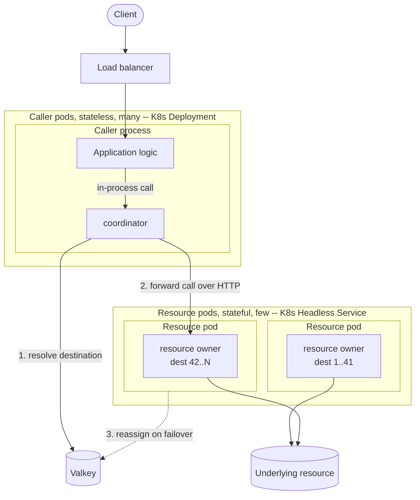
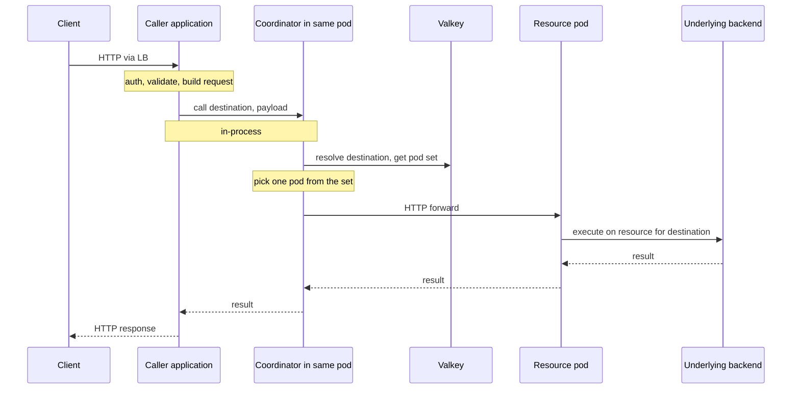
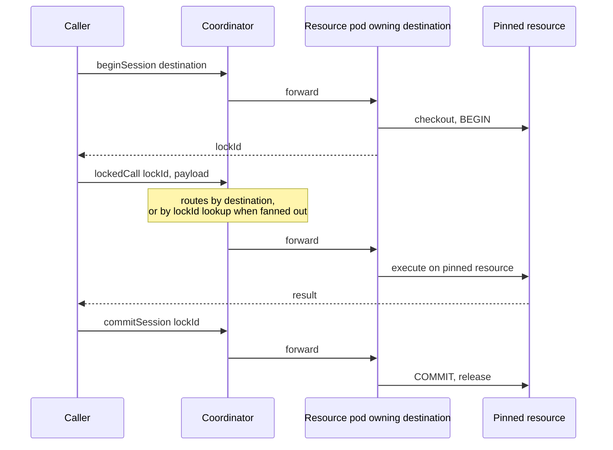
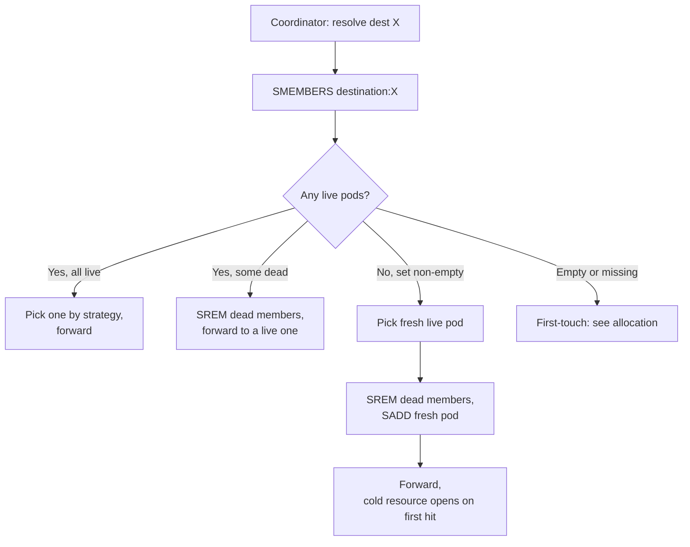
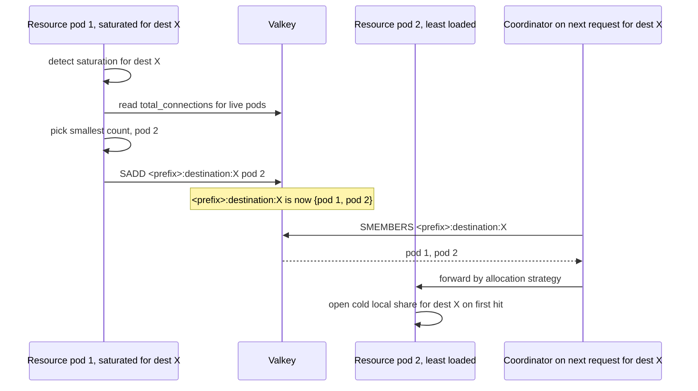

# The Coordinator Pattern

A design note for `@platformatic/coordinator`. The library implements the runtime primitives described below; this document explains the architecture they fit into and why each piece is shaped the way it is.

## Architecture



Steps 1 and 2 run on every call; step 3 only on failover. The router-to-resource hop is the only HTTP hop on the resource path. It replaces the per-call overhead of local resource management with a single network hop to a warm shared owner.

## The Two Sides

The library splits into two halves with a clear contract between them:

- **The resource pod** owns the stateful thing (connection pools, agent processes, sandboxes, simulations). It self-registers, heartbeats, and is responsible for fanning a destination out when its local share saturates. It runs the `Member` class.
- **The coordinator** lives co-located with the caller. It receives application calls, resolves a destination through Valkey, and forwards the call over HTTP to the owning resource pod. It runs the `Registry` class.

The caller speaks to the coordinator over an in-process channel (function call, message port, Watt Messaging API, etc.). The coordinator speaks to resource pods over HTTP. Both relationships are pluggable; the library does not mandate either transport.

## Per-Request Flow



Two HTTP hops on the external path (client to caller, coordinator to resource pod). Two Valkey reads per call worst case (the destination's pod set, then a chosen pod's address); most hit a short-lived local cache. When a destination is served by more than one pod, the coordinator picks among the destination's current pod set using the same allocation strategy as first-touch. The coordinator runs in every caller pod, so Valkey load scales with the caller tier. Valkey is cheap; the underlying resource (connections, sessions, etc.) is not.

## No Stateful Protocol Needed

Many resource protocols are stateful: database connections carry session state, transactions, advisory locks, and prepared statements; long-lived agents hold conversation context. Designs that proxy raw resource traffic preserve that statefulness via sticky TCP between client and owner. This pattern does not. The resource's statefulness is contained inside the resource pod's local owner; the hop between coordinator and pod is plain HTTP carrying a request payload, response payload, and opaque lockIds where needed.

A lockId does not need TCP-socket affinity, only routing to the pod that holds the pinned resource. Destination-based routing handles the single-pod case; the lockId resolves through Valkey for the fanned-out case (see "Transactions and Locks"). The coordinator stays stateless throughout, and standard HTTP/2 multiplexing and L7 load balancing apply on the resource hop.

The in-process channel between caller and coordinator is an optimization for co-location. The design does not depend on it: caller and coordinator could be split into separate deployments and use HTTP on that hop too, at the cost of one extra network round-trip per request.

## Transactions and Locks

Some resources are bound to a single owner for the lifetime of a session (a database transaction pinned to a connection, an agent step pinned to a process). Pinning happens on the resource pod under an opaque lock ID. When a destination is served by a single pod (the common case), destination-based routing is enough: every follow-up call lands on the pod that minted the lock. When a destination is fanned out across multiple pods (see "Load Metrics and Fan-out"), the coordinator resolves the lock ID through Valkey to find the owning pod and forwards there. The resource pod validates the token against its lock table. The lock ID stays opaque to clients throughout; only the coordinator and resource owner know the routing record.



From the caller's perspective:

```ts
const { lockId } = await client.beginSession(destinationId)
// lockId is now a token; treat it as opaque

await client.lockedCall(lockId, payload1)  // same pod, automatic
await client.lockedCall(lockId, payload2)  // same pod, automatic
await client.commitSession(lockId)         // same pod, automatic
```

The caller never sees, parses, or cares which pod holds the pinned resource. The coordinator looks up the lockId in Valkey on every call and forwards to that pod, where the pinned resource lives. If the pod dies mid-session, the next call comes back as a session failure; the caller handles it like any other transient error and retries at the request level.

Four invariants:

1. **The lock ID is opaque to clients.** Callers cannot construct it. The coordinator only uses it as a lookup key; the resource owner owns the lock record and the pinned resource.
2. **Coordinators hold no lock state.** They route by destination; lock metadata, pinned resources, and timers live on the resource pod.
3. **The lock record is in Valkey, but the pinned resource is not.** The coordinator can resolve a lock from any Valkey replica, yet the live resource still lives only on the pod that minted it. If the pod exits, the lock record becomes invalid and the caller retries at the request level.
4. **The resource owner enforces cleanup.** Idle timeout, max lifetime, automatic rollback on channel close. Callers are not trusted to clean up locks they forgot.

### Cancellation

`AbortSignal` does not cross an in-process channel boundary in every runtime. Caller-side calls return a request ID; abort or timeout becomes an explicit `cancel(requestId)` message. The coordinator forwards it; the resource owner cancels the in-flight operation.

## What Each Layer Owns

| Layer | Owns |
|---|---|
| **Caller application** (stateless) | HTTP, auth, request validation, business logic, building the resource request, calling the coordinator |
| **Coordinator** (built on `@platformatic/coordinator`) | Coordinator entry point, Valkey destination resolution, HTTP forwarding, short-lived lookup cache, orphan detection and reassignment, picking among a destination's pod set when it is fanned out, routing locked calls by looking up the lock record in Valkey |
| **Resource pod** | Local resource ownership (pools, sessions, sandboxes), destination provisioning, lifecycle, transactions/sessions, pinning, cancellation, retry policy, metrics, lock timeouts, Valkey self-registration and heartbeat, publishing a load metric, detecting saturation, fanning a saturated destination out to the least-loaded live pod |

The coordinator does not understand application semantics, parse payloads, authenticate, or hold resource/session/lock state. Its only job is to pick the right resource pod and forward the call.

## Valkey State Model

Valkey is the shared coordination layer for live pod membership, destination ownership, and lock routing.

| Key | Shape | TTL | Owned by | Purpose |
|---|---|---|---|---|
| `<prefix>:member:<podId>` | hash with fields `address` and `total_connections` | 30 s, refreshed by heartbeat | resource pod | live pod registration and load metric |
| `<prefix>:destination:<destinationId>` | set of `podId` values | none | coordinator and resource pod | the destination's pod set, sole source of truth for routing |
| `<prefix>:lock:<lockId>` | hash with `podId`, `destinationId`, and lock metadata | session or lock lifetime | resource pod | resolve lock-bound follow-up calls |

The coordinator resolves stateless requests from the destination set on every call. First-touch placement and failover both mutate the set via `SADD` / `SREM`; no separate binding key exists. For lock-bound requests, the coordinator resolves the lock record first and then forwards to the owning pod. Resource pods are responsible for writing and cleaning up their own lock records.

## Failure Handover

When a resource pod dies, its member record in Valkey expires after the TTL (30 s). Destination sets have no TTL, so they outlive the pod and may briefly point at dead members. The next call for one of those destinations cleans up and routes.



Locks and sessions on the dead pod are gone. The design does not try to migrate them. The caller sees a normal failure and retries at the request level.

`SADD` and `SREM` are atomic on their own, so concurrent reassignments by two coordinators are safe: both `SREM` the same dead member (idempotent), and if both `SADD` fresh picks, the destination ends up briefly fanned out across both new pods. That is a valid steady state.

When a fanned-out destination loses one of its pods, the others keep serving. The coordinator `SREM`s the dead member on the next lookup that observes a dead address; the remaining pods cover the destination with no cold-resource moment.

## Load Metrics and Fan-out

Each resource pod publishes its current load to Valkey on every heartbeat. The heartbeat updates the `total_connections` field of the member record (`HSET <prefix>:member:<id> total_connections <N>`) in the same pipeline that resets the record's TTL. The field is named `total_connections` for historical reasons (the database case), but the value is just an integer load metric; the meaning is whatever the pod decides via `getTotalConnections`. It serves operator scaling decisions and the runtime fan-out logic below.

A destination is normally bound to one pod. When that pod's local share for a destination saturates (the per-destination cap is reached and the wait queue stays non-empty past a configured threshold), the pod fans the destination out. It reads `total_connections` for every live pod, picks the one with the smallest count, and adds it to the destination's pod set: `SADD <prefix>:destination:X memberId`. The coordinator notices the expanded set on the next lookup and starts splitting requests across both pods.



The saturating pod initiates fan-out, not the coordinator. The decision is local: the pod sees its own share saturating and acts. Multiple pods can fan in over time if load keeps climbing; each adds itself at most once.

The coordinator picks among a destination's pod set on the request path using the same `AllocationStrategy` as first-touch. With `round-robin`, requests cycle through the destination's pods. With `least-loaded`, each request goes to the pod in the set with the fewest total connections.

Reducing fan-out (removing a pod from a destination's set when load drops) is not a runtime concern. It is an operator action or a slow background reconciler; running it from the data path risks thrash under bursty load.

## Why Kubernetes

The architecture leans on two K8s features that some other platforms (ECS, plain VM fleets) do not directly provide:

- **Headless Services**: the coordinator addresses resource pods by pod IP, read from Valkey. Platforms that route traffic through load balancers or DNS service discovery typically do not expose a stable per-pod endpoint for the coordinator to dial directly.
- **Stable pod identity** (StatefulSet-style): the identity registered into Valkey is the pod's K8s identity. Ephemeral task IPs force the heartbeat path to do more work after every restart.

The in-process co-location of caller and coordinator inside one process is a separate constraint and works on either platform. ECS can be made to work with Cloud Map for service discovery and a custom registration path, but at meaningful cost to operational simplicity.

## Scaling

The scaler reads each pod's `total_connections` from Valkey and adds a resource pod when it climbs past a threshold. Platformatic ICC supports arbitrary metrics, including this one. New destinations land on the new pod via the allocation strategy; existing destinations stay sticky.

### How allocation works

The strategy runs at first touch, when the coordinator sees a destination with no pod set, and at failover, when an existing set has no live members. When a destination has more than one live pod, the same strategy also chooses the request target from that pod set on the hot path. The strategy does not run for single-pod destinations after they are bound.

The flow at first touch:

1. Coordinator receives a request for destination *D*.
2. Registry runs `SMEMBERS <prefix>:destination:D`; set is empty.
3. Registry calls `strategy.pick(liveMembers, { instanceId: D })`.
4. Registry runs `SADD <prefix>:destination:D <pickedPod>`. Concurrent racers each add their pick; the set's members are all valid serving pods for D.
5. Coordinator forwards to the picked pod.

Built-in strategies:

- **Round-robin**: each coordinator replica keeps an in-memory cursor that advances per pick. Different replicas have independent cursors but over time spread evenly across pods. Zero Valkey reads per pick.
- **Least-loaded**: reads `total_connections` from each candidate pod's member record (a pipeline of `HGET`s). Smallest wins; ties go round-robin. One extra Valkey round-trip per pick. For single-pod destinations, that means first touch only; for fanned-out destinations the cost lands on every request.
- **Random**: a `Math.random()`. For zero-coordination sharding.

Custom strategies receive the destination ID through the context and can branch on it. For example, send tagged "dedicated" tenants to a designated pod and round-robin "shared" ones across the rest. The classification source is left to the integrator: a config service, a Valkey tag, a database lookup.

Failover runs the same `strategy.pick(...)` and applies the change with `SREM` for dead members and `SADD` for the freshly picked pod. Both are atomic; concurrent racers may end up with multiple new members in the set, which is acceptable.

### High-volume and low-volume tenants

Two tenant regimes coexist, and the design treats them differently.

Low-volume tenants are many, each cheap. Round-robin or least-loaded allocation packs many destinations per pod. Cold-start cost is paid once per tenant on first hit; the warm footprint is small. Most tenants live their entire life on a single pod.

High-volume tenants are few, each expensive. A single tenant can outgrow a single pod's local capacity. The architecture handles this *reactively* through fan-out (see "Load Metrics and Fan-out"): when a tenant saturates a pod's local share, the pod adds another pod to the tenant's set and the coordinator spreads load across them. Per-tenant caps inside the resource owner keep one tenant from monopolizing a pod's budget while the fan-out signal builds.

Reactive fan-out works well for tenants whose volume is hard to predict. For tenants known in advance to be heavy (a large enterprise customer, a regional shard), proactive provisioning is still useful: tag the tenant as "dedicated" at first touch and use a custom `AllocationStrategy` that pins it to a designated subset of pods from the start. The two mechanisms compose: a tenant pinned to a dedicated pod can still fan out further if it outgrows it.

Rebalancing an established destination (moving it to a different pod, rather than adding another) is expensive: the old pod's local share drains, the set membership flips, the new pod opens cold. It should be opt-in, triggered by operator action or a slow background job, not by autoscaling. Adding capacity is cheap; fan-out is cheap; reshape is not.
